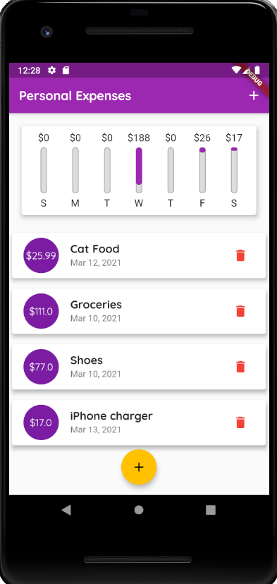

**App title:** 

**PERSONAL EXPENSES PLANNER*

**App description:**

App is used to track your most recent expenses of any kind. User is able to add new expense with a simple button and modal-form combination. On the top of the app there is a chart that dynamically updates expenses sorted by the most recent days (last 7 days to be exact).

**Project made solely by:** Emerald Podbićanin

**Developed with:** Flutter

**Note:** App home page can be seen in the image in the root of this repository

